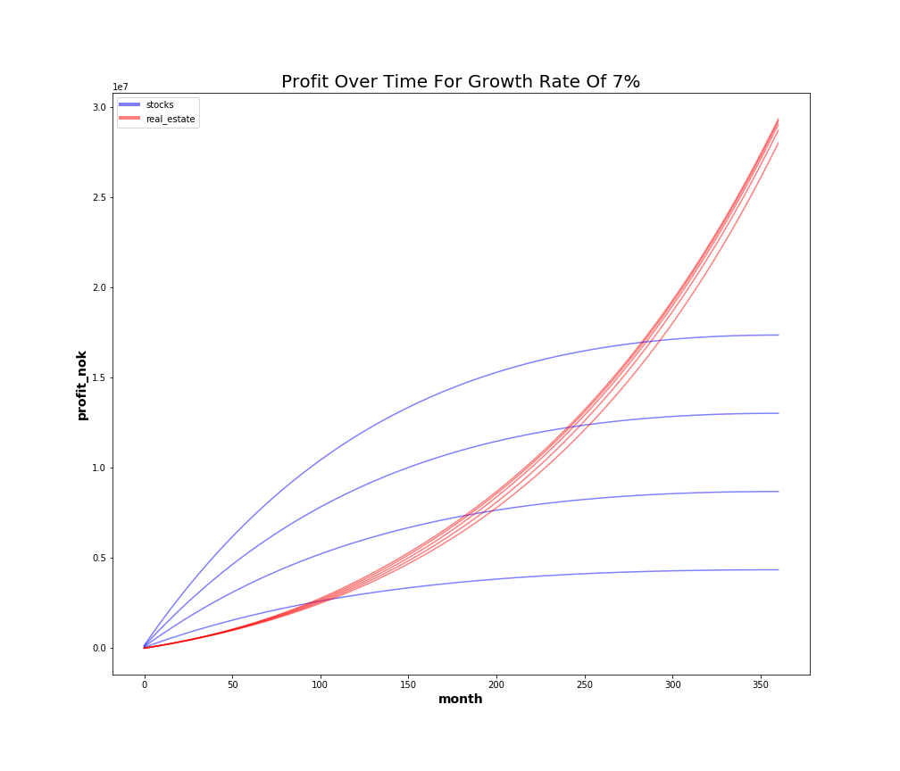

# Real Estate Simulation
Simulate the impact of real estate price, currency exchange rates and market development on the profitability of private real estate.

  

For the actual run and analysis of the resultsm, start at the [analysis.ipynb](https://github.com/rossrco/real_estate_sim/blob/master/analysis.ipynb) notebook.

# Disclaimer
**NO FINANCIAL ADVICE.** The content of this repository is meant for informational purposes only. Do not consider any such information or other material as legal, tax, investment, financial, or other advice.

# Domain Background
Having a diverse portfolio of investments is a cornerstone in personal wealth managment. For many individuals, real estate constitutes a considerable part of their personal portfolio. While the real estate investment risks are not exactly the same as the stock, bond or foreign currency investment risks, the former tend to be related to the latter.

> Example: Living outside the US means that real estate is purchased using a different currency from the USD. The price of that currency can change and therefore influence the value of the real estate relative to the purchasing power of the US dollar.

This means that an informed personal portfolio strategy is influenced by the following factors:
* The expected market price of real estate;
* The expected currency exchange rates;
* The expected condition of the stock market;

The last point pertains to the proportion of capital invested in real estate and stocks.

In general, one should continuously evaluate the question: *'Given a certain amount of capital, what is the correct allocation percentage between the various available investment vehicles in the personal portfolio.'*

# Problem Definition
In order to address the challenge of capital allocation in a personal portfolio, one needs to simulate a range of possible scenarios. Each scenario represents the interaction between various levels of stock market, foreign currency and real estate appreciation or depreciation levels.

The distribution of the results of all scenarios is expected to provide a indication for the capital allocation.

# Solution
We will build a simulation engine that allows us to input a list of scenarios. Each scenario can consist of:
* Different real estate asset;
* Different mortgage on the real estate;
* Different percentages of growth of real estate prices and of stock market prices;
* Different levels of investment in the real estate asset or in stocks (in the case of the real estate asset, this would translate to overpayment of the mortgage);

We will then run a grid search over all scenarios and analyze the results.

# Repository Structure
The definitions of the simulation artifacts is located in the [utils.py](https://github.com/rossrco/real_estate_sim/blob/master/utils.py) file. The simulation run and the analysis of the results is done in the [analysis.ipynb](https://github.com/rossrco/real_estate_sim/blob/master/analysis.ipynb) notebook.